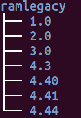

```{r setup, include = FALSE}
knitr::opts_chunk$set(
  collapse = TRUE,
  comment = "#>"
)
```

## RAM Legacy Stock Assessment Database
From the database's [website](www.ramlegacy.org):

> The RAM Legacy Stock Assessment Database is a compilation of stock assessment results for commercially exploited marine populations from around the world. It is inspired by Dr. Ransom A. Myers' original [stock-recruitment database](http://wayback.archive-it.org/org-990/20170328023224/http://www.mscs.dal.ca/~myers/welcome.html), which is no longer being updated."

As of April 2019, the available versions are 1.0, 2.0, 2.5, 3.0, 4.3, 4.40, 4.41, 4.44.

The latest versions of the database (v4.44, v4.41, v4.40) are available at [Zenodo.](https://zenodo.org/communities/rlsadb/). This is where `download_ramlegacy` downloads the database from.

The older versions of the database (v4.3, v3.0, v2.5, v2.0, v1.0) are available in **Excel** (Microsoft Excel Open XML Format Spreadsheet) format at this [github repo](https://github.com/kshtzgupta1/ramlegacy-assets).

## About the package
The goal of `ramlegacy` is to cache a specified version(s) of the RAM Legacy Stock Assessment Excel Database and this way save time and effort spent in re-downloading different versions of the database as part of any future analysis involving the data. The package also supports reading in any specified dataframe(s) of the database through a function called `load_ramlegacy()`. The user can always view the location to which the database is cached and read from by running `ram_dir()` and specifying its version argument. This vignette will outline a few more details about these functions and the package that will hopefully make `ramlegacy` easy to use.

## Package Installation
You can install the development version from [GitHub](https://github.com/ropensci/ramlegacy) with the `install_github` function available in `devtools` package:

```{r, eval = FALSE, echo = TRUE}
install.packages("devtools")
library(devtools)
install_github("ropensci/ramlegacy")
```

To ensure that the vignette is installed along with the package make sure to remove `--no-build-vignettes` from the `build_opts` in `install_github`

## download_ramlegacy
You can download any available version of the RAM Legacy Stock Assessment Excel Database ("1.0","2.0", "2.5", "3.0", "4.3", "4.40", "4.41", and "4.44") through `download_ramlegacy()`:

```{r, download_ramlegacy_example1, eval=FALSE, echo = T}
# download version 1.0
download_ramlegacy(version = "1.0")

# download version 2.0
download_ramlegacy(version = "2.0")

# download version 2.5
download_ramlegacy(version = "2.5")

# download version 3.0
download_ramlegacy(version = "3.0")

# download version 4.3
download_ramlegacy(version = "4.3")

# download version 4.44
download_ramlegacy(version "4.44")
```

If version is not specified then `download_ramlegacy` will default to downloading the
latest version of the database:

```{r, download_ramlegacy_example2, echo = T, eval = F}
# downloads latest version (currently 4.44)
download_ramlegacy()
```
If you want to download multiple versions please download them one at a time as passing them all at once will throw an error.

To enable caching behavior, before downloading the specified version `download_ramlegacy` checks whether that version has already been downloaded. If it is then `download_ramlegacy` gives the user the option to either download again and overwrite the existing version or not download and just exit the function. This behavior is modified if `overwrite`, a function argument to `download_ramlegacy`, is set to true. Then even if the version has already been downloaded calling `download_ramlegacy` will download it again overwriting the already present version. After downloading the database download_ramlegacy caches it by converting it to an RDS object which can then be read in through calling `load_ramlegacy()`. 

`download_ramlegacy` also has three other arguments: `ram_path`, `ram_url`, and `quiet`. By default `ram_path` has been set to a location provided by the rappdirs package and can be viewed by calling `ram_dir(vers = "version")`. Although this is **not the recommended approach** download_ramlegacy supports downloading to a user-specified path. `ram_url` is fixed to the zenodo URL of the database. Please do not **pass in any other url** to ram_url. By default, `download_ramlegacy` after it is called keeps the user updated of the download progress through status messages. Setting `quiet` to TRUE enables the user to suppress all status messages.

### File Structure of Downloaded Database
This section illustrates the contents and file structure of the directory to which the database is saved once you call `download_ramlegacy`

If you have downloaded multiple versions through `download_ramlegacy()` the contents of ramlegacy directory (the path to this directory can be viewed by calling `ram_dir()`) on your local computer will look something like this with each version geting its own subdirectory within the directory:





For older versions (1.0, 2.0, 2.5, 3.0, 4.3) the contents of the version subdirectory look like this:


For these older versions, the version subdirectory would contain the excel database and serialized database saved under the names `RLSADB v <version no> (assessment data only).xlsx` and `v <version number> .rds` respectively.

For newer versions (4.40, 4.41, 4.44) along with the excel file of the database file other documents like stock summary files are also downloaded:


The actual excel file of the database and the serialized rds database will be present as `RLSADB v <version no> (assessment data only).xlsx` and `v <version no> .rds` respectively inside the `DB Files With Assessment Data` folder.

## Description of Tables and Stock Summary Files within the Database
For a description of the dataframes present in the database as well as information on the stock summary files 
present in the database please see this [page.](tables_description.html)

## load_ramlegacy
`load_ramlegacy` can be used to obtain a list of particular dataframes and passed in to the `tables` argument. To get a list of all the dataframes within a specific version of the database set `tables = NULL`. Make sure that the version you want to load was downloaded and is already present locally at the path you specify using `ram_path` otherwise `load_ramlegacy` will throw an error. 

```{r, load_ramlegacy_example1, echo = T, eval = F}
# returns a list containing area and bioparams tables from version 4.44 database
load_ramlegacy(version = "4.44", tables = c("area", "bioparams"))
```

In case in you want to load multiple versions please load them one at a time as passing them all at once will throw an error. Similar, to `download_ramlegacy`, `load_ramlegacy` has a `ram_path` argument which is set to local directory where the specified version of the RAM Legacy Stock Excel Assessment Database was downloaded. You can view that path through `ram_dir(vers = "version")`. Although this is **not the recommended approach** load_ramlegacy supports reading in the database's dataframes from a user-specified path provided that the database is present at the specified path as an rds file.
  
## ram_dir
To see the path of the directory where the specified version of database was downloaded on the user's computer, the user can call `ram_dir`. Note that this is also the location from which `load_ramlegacy` reads in the database. 

For example, to see where version 4.3 of the database was downloaded you can call:

```{r, ram_dir_example1, echo = T, eval = F}
# view the path where version 4.3 of the database was cached
ram_dir(vers = "4.3")
```
